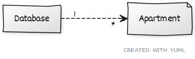
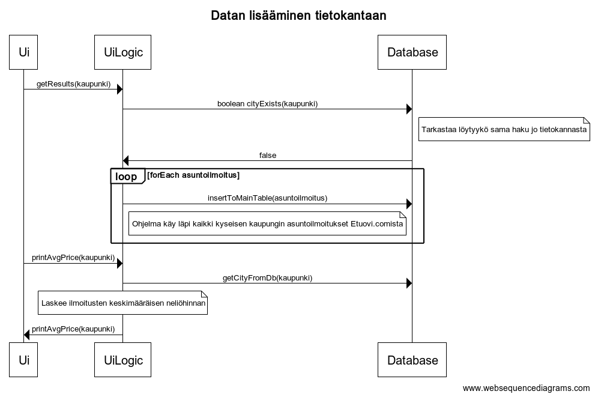

##Käyttöliittymä
Tekstikäyttöliittymä, jossa käyttäjä voi 
1. Tehdä haun uuden kaupungin asuntoilmoituksista
2. Katsoa hakuhistorian
3. Tyhjentää tietokannan
0. Poistua näkymästä

##Sovelluslogiikka
Sovelluksen datamallin muodostavat luokat Database ja Apartment, jotka kuvaavat tietokantaa ja yksittäisen asuntoilmoituksen yksityiskohtia.

##Päätoiminnallisuudet

###Ilmoitusten haku ja lisääminen tietokantaan

